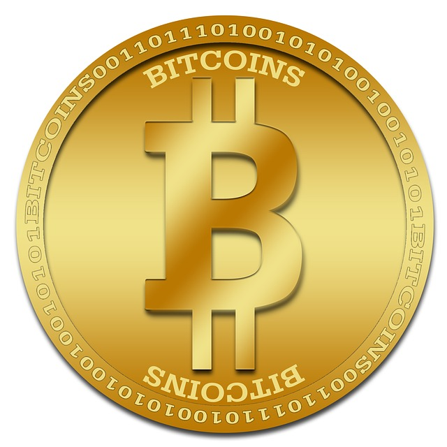
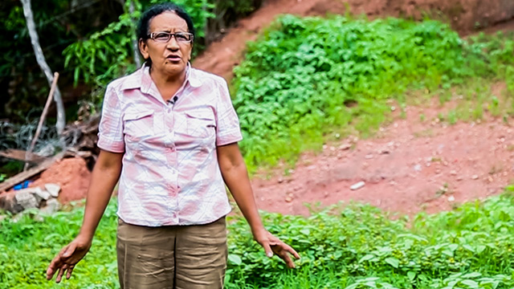

class: center, middle

# Blockchain Applications for Healthcare
## Dan Hedges

---
name: bitcoin
# What is Bitcoin?

- Cryptocurrency
- More than just a serial number
    - Double-spend problem

---
name: blockchain
# What is the Blockchain?

--

- Public ledger of all transactions

--

- Every node has access to all transactions

--

- Current volume is ~80GB

---

name: blockchain-transactions
# What's in a Blockchain Transaction?

--
1.

---

name: blockchain-versions
# Blockchain Application Classifications

--

1.0 Currency: Payment Systems

--

2.0 Contracts: Mortgages, Titles, Smart property, Smart Contracts

--

3.0 Beyond: Government, Culture, Art, Healthcare

---

name: blockchain-contracts

# Property

Mariana Catalina Izaguirre. Photo: Revistazo

???
Notes about Mariana
Story reported in *The Economist*:
http://www.economist.com/news/briefing/21677228-technology-behind-bitcoin-lets-people-who-do-not-know-or-trust-each-other-build-dependable

---

name: pre-blockhain-proof-of-existence

# Proof of Existence

???
TODO: Image of self-addressed stamped envelope, or else a screen cap from the movieQuiz Show.

In the movie *Quiz Show*, a trivia game show contenstant was given the questions and answers before the show aired, and was told by the show's producers exactly where to give an incorrect answer and lose.  He couldn't go public at the time, and he wanted in the future to be able to prove that this happened.  He sent a copy of the questions and answers to himself in a self-addressed stamped envelope.  The postmark was from the day before the show aired.  Years later, when a reporter asked him about it, he produced the still-sealed letter and proved the scandal true.

That's fine for a dramatic plot point, but would it really be provable in a court of law today?  Aren't there easy ways for people to fake a postmark?  After all, it's just a stamp.  Or what about sending the envelope empty and unsealed, and then putting a document inside and sealing it after you receive the postmarked envelope?  In today's society, wouldn't a person of means be able to easily fake this?

---

name: blockchain-proof-of-existence

# Blockchain Proof of Existence

Scenario: you are a graphic designer meeting with a company to pitch them on a new logo you designed for them.  If they turn you down, but then start using your logo, or a similar one, you want to sue them.

--

* Create a document with your name on it, and include the logo.

--

* Compute the hash of your document.

--

* Store the hash on the blockchain.

--

* Keep your document, unaltered.

--

* At any time in the future, you can produce the document, and find its hash in the blockchain, to prove that it existed at that time.

???
Maybe this slide can be depicted entirely through images.

---

name: blockchain-healthcare

# What does Blockchain have to do with Healthcare?

--

It's not obvious.

---

name: roadhouse-healthcare
# Roadhouse Healthcare

In the movie "Roadhouse", Patrick Swayze's character is so tough, he brings
his entire medical record with him wherever he goes, anticipating that he
will get into fights, and need to bring it with him to the doctor.

The doctor is so impressed, she sleeps with him.

(Or, it might have been his suave eloquence, e.g. "Pain don't hurt.")

The point is, he controls his own medical record.

---

name: blockchain-emr
# Blockchain EMR

So, what would a blockchain EMR look like?

1. We don't know.  It's too early to tell at this point.  There are no such
systems deployed in production at this time.

2. Access to a patient's health record would be owned by the patient.  The
patient needs to give permission to every doctor who wishes to view her medical
history, or append to her record.

    * Changes to permissions would be recorded on the blockchain.

3. Medical data would not be stored on the blockchain.

    * Instead, the blockchain could hold "pointers" to data.

4. Mining costs must be paid by someone

    * Perhaps clinical researchers could be compensated in health data?
