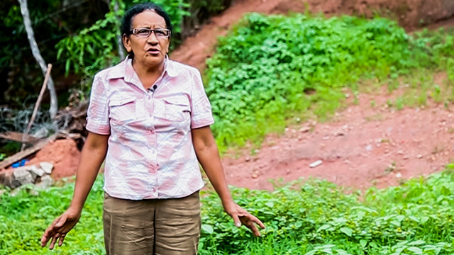

## Blockchain for Healthcare

### Dan Hedges

Note: 1

## What is Blockchain?

<!-- .element  class="fragment" height="35%" -->

<!-- .element  class="fragment" height="35%" -->

Note: When you hear blockchain, you should think of Bitcoin: the world's first
successful distributed cryptocurrency.  Bitcoin was invented in 2009 by an
unknown person under the pseudonym Satoshi Nakamoto, and one of the innovations
it created was the blockchain.  The term "blockchain" can be used to describe
the Bitcoin implementation, or the  technology.  

## Blockchain Applications

- Blockchain 1.0: Currency <!-- .element  class="fragment" height="35%" -->
    - Bitcoin <!-- .element  class="fragment" height="35%" -->
- Blockchain 2.0: Contracts <!-- .element  class="fragment" height="35%" -->
    - Mortgages, Titles, Smart Property, Smart Contracts
- Blockchain 3.0: Applications <!-- .element  class="fragment" height="35%" -->
    - Government, Culture, Art, Healthcare

Note:
Source: Blockchain: Blueprint for a New Economy, by Melanie Swan, O'Reilly 2015

# Blockchain 1.0
### Currency

## Terms

- Digital currency -- think of a Starbucks gift card, or rewards card
<!-- .element  class="fragment" height="35%" -->
- Cryptocurrency -- a digital currency that relies on cryptography
<!-- .element  class="fragment" height="35%" -->
- Distributed Cryptocurrency -- Bitcoin was the first
<!-- .element  class="fragment" height="35%" -->

## Blockchain

# Blockchain 2.0
### Contracts

## Property

Mariana Catalina Izaguirre. Photo: Revistazo

Note:
Source: *The Economist*:
http://www.economist.com/news/briefing/21677228-technology-behind-bitcoin-lets-people-who-do-not-know-or-trust-each-other-build-dependable

This is Mariana Catalina Izaguirre.  In 2009, the police came to evict her from
the house she was living in, at the request of the registered owner, who would
tear it down and rebuild.  Trouble was, Izaguirre, who had lived there for
thirty years, actually owned the land.  She had the deed to prove it.  The
Property Institute held fraudulent documentation filed by a criminal "owner".
Fortunately, Izaguirre had documentation -- an official title and deed to the
land -- so thankfully it was all straigtened out.  But only after she was
forcibly evicted while her children were at school, so her house could be
demolished.

This story happened in Honduras, and it is not uncommon in developing countries.
In the U.S., we sometimes take for granted that our government doesn't
routinely give in to corruption and bribes.

So, what can the Blockchain do for Mariana?

## Public Records
